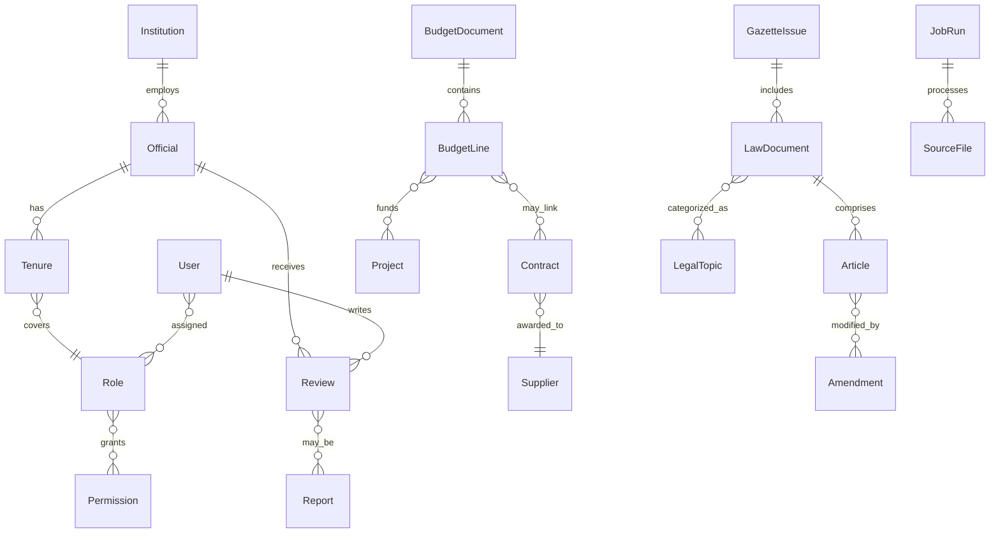

## Convergence – Logical Data Model (Conceptual)

### Conceptual Entities (by domain)
- Governance: Institution, Official, Role, Tenure, PerformanceMetric
- Citizen: User, Profile, Reputation, Review, Report, Badge
- Economic: BudgetDocument, BudgetLine, Contract, Supplier, Project, AuditReport, Indicator
- Legal: GazetteIssue, LawDocument, Article, Amendment, LegalTopic, ReferenceLink
- System: JobRun, SourceFile, LogEvent, Notification, Role, Permission, APIKey

### Relationships (Mermaid ER, conceptual)

Notes:
- Multiplicities are indicative; details refined during LDM→PDM transition.
- System roles/permissions distinct from domain `Role` (official role); name carefully in PDM.

