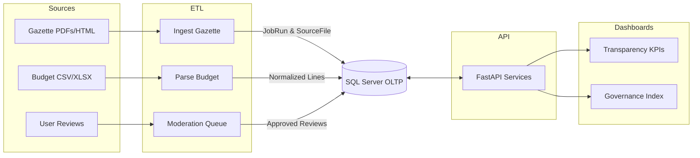

## Convergence – Process Flow (ETL → DB → API → Dashboard)

Key controls:
- Every ETL step records `JobRun` and `SourceFile` with checksums and timestamps.
- Validation gates (schema, referential). Failed items quarantined for review.
- Observability: logs with correlation IDs; metrics on throughput and failures.

