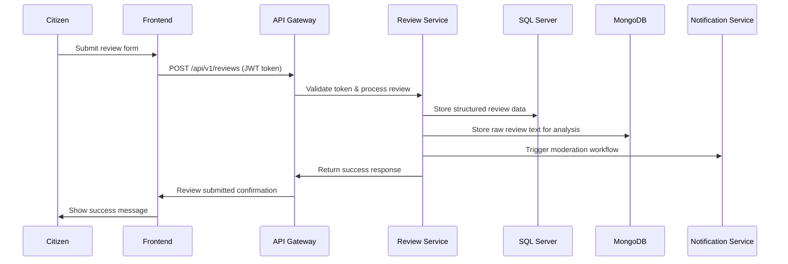
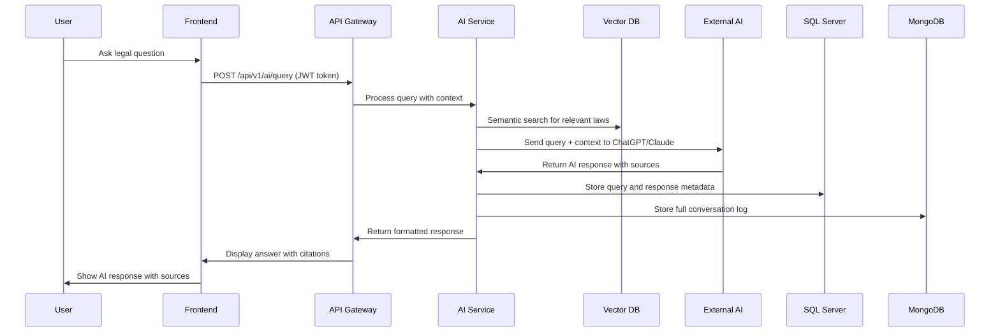
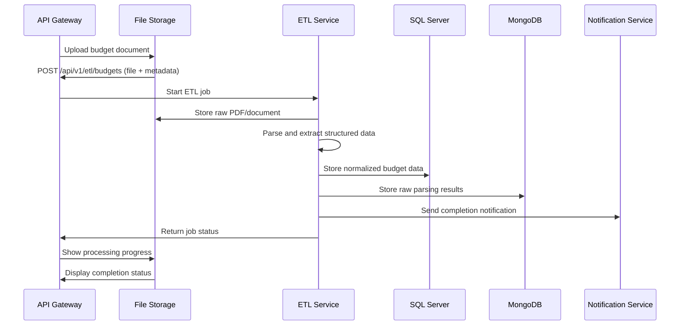

# System Architecture Design (SAD) - Convergence Platform

**Version:** 1.0  
**Date:** January 2025  
**Project:** National Civic Intelligence Platform for Morocco  
**Scope:** Complete system architecture for enterprise-scale deployment  

---

## 🎯 **Architecture Objectives**

The Convergence Platform architecture is designed to support:

- **Government Data Transparency** - Budget, legal, and institutional data access
- **Citizen Engagement** - Reviews, ratings, and feedback mechanisms
- **AI-Powered Legal Assistance** - Multi-provider LLM integration (ChatGPT/Claude)
- **Dual Storage Strategy** - SQL Server for structured data, MongoDB for raw/unstructured
- **Professional Dynamic Frontend** - React-based with Arabic RTL support
- **Enterprise Security** - Multi-layer security with comprehensive audit trails
- **Morocco-Specific Requirements** - Local data sources, Arabic/French localization

---

## 🏗️ **High-Level Architecture Overview**

```
┌─────────────────────────────────────────────────────────────────┐
│                    FRONTEND LAYER                               │
│  React + TypeScript + Tailwind CSS + Vite                      │
│  ┌─────────────┐ ┌─────────────┐ ┌─────────────┐ ┌─────────────┐│
│  │   Legal     │ │   Budget    │ │   Reviews   │ │   AI Chat   ││
│  │ Repository  │ │  Explorer   │ │   System    │ │   Widget    ││
│  └─────────────┘ └─────────────┘ └─────────────┘ └─────────────┘│
│  ┌─────────────┐ ┌─────────────┐ ┌─────────────┐ ┌─────────────┐│
│  │ Institution │ │ Moderator   │ │  Awareness  │ │   Admin     ││
│  │ Directory   │ │  Console    │ │    Hub      │ │ Dashboard   ││
│  └─────────────┘ └─────────────┘ └─────────────┘ └─────────────┘│
└─────────────────────┬───────────────────────────────────────────┘
                      │ HTTPS/WSS + JWT Authentication
┌─────────────────────▼───────────────────────────────────────────┐
│                    API GATEWAY                                  │
│  FastAPI + Rate Limiting + CORS + Request Routing              │
│  ┌─────────────┐ ┌─────────────┐ ┌─────────────┐ ┌─────────────┐│
│  │   Auth      │ │   Legal     │ │   Budget    │ │   Reviews   ││
│  │  Service    │ │  Service    │ │  Service    │ │  Service    ││
│  └─────────────┘ └─────────────┘ └─────────────┘ └─────────────┘│
│  ┌─────────────┐ ┌─────────────┐ ┌─────────────┐ ┌─────────────┐│
│  │Institution  │ │   AI        │ │   ETL       │ │  Moderation ││
│  │  Service    │ │ Gateway     │ │  Service    │ │  Service    ││
│  └─────────────┘ └─────────────┘ └─────────────┘ └─────────────┘│
└─────────────────────┬───────────────────────────────────────────┘
                      │
    ┌─────────────────┼─────────────────┐
    │                 │                 │
    ▼                 ▼                 ▼
┌─────────┐    ┌─────────────┐    ┌─────────────┐
│SQL SERVER│    │   MONGODB   │    │  EXTERNAL   │
│(Primary) │    │  (Raw Data) │    │   AI APIs   │
│         │    │             │    │             │
│Structured│    │Unstructured │    │ChatGPT/     │
│Entities │    │Raw Content  │    │Claude API   │
│Audit Logs│    │Chat Logs    │    │Embeddings   │
│Users    │    │Analytics    │    │Vector Store │
│Laws     │    │ETL Metadata │    │             │
│Budgets  │    │File Storage │    │             │
│Reviews  │    │             │    │             │
└─────────┘    └─────────────┘    └─────────────┘
```

---

## 🔧 **Core Components & Technology Stack**

### **Frontend Layer**
| Component | Technology | Purpose |
|-----------|------------|---------|
| **UI Framework** | React 18+ with TypeScript | Component-based UI development |
| **Styling** | Tailwind CSS + Headless UI | Consistent design system |
| **Build Tool** | Vite | Fast development and building |
| **State Management** | Zustand | Lightweight state management |
| **Routing** | React Router v6 | Client-side navigation |
| **Internationalization** | react-i18next | Arabic RTL + French/English |
| **Charts** | Recharts | Data visualization |
| **Forms** | React Hook Form + Zod | Form handling and validation |

### **Backend Layer**
| Component | Technology | Purpose |
|-----------|------------|---------|
| **API Framework** | FastAPI (Python 3.11+) | High-performance async API |
| **Authentication** | JWT + OAuth2 | Secure token-based auth |
| **ORM** | SQLAlchemy 2.0 | Database abstraction |
| **Migrations** | Alembic | Database schema management |
| **Validation** | Pydantic v2 | Request/response validation |
| **Background Jobs** | Celery + Redis | Async task processing |
| **Caching** | Redis | Session and API caching |
| **File Processing** | pdfplumber + pytesseract | PDF and OCR processing |

### **Database Layer**
| Component | Technology | Purpose |
|-----------|------------|---------|
| **Primary Database** | Microsoft SQL Server | Structured relational data |
| **NoSQL Database** | MongoDB | Raw documents and unstructured data |
| **Vector Database** | FAISS (local) / Milvus | Semantic search embeddings |
| **Search Engine** | SQL Server Full-Text | Full-text search capabilities |

### **AI & External Services**
| Component | Technology | Purpose |
|-----------|------------|---------|
| **AI Providers** | OpenAI GPT-4 / Anthropic Claude | Legal Q&A and analysis |
| **Embeddings** | Sentence Transformers | Semantic search vectors |
| **Vector Search** | FAISS | Similarity search |
| **Email Service** | SendGrid / AWS SES | Transactional emails |
| **File Storage** | Local filesystem → Azure Blob | Document storage |

---

## 🏛️ **Modular Backend Architecture**

### **Service-Oriented Structure**
```
src/
├── main.py                 # FastAPI application entry point
├── api/                    # API route handlers
│   ├── v1/                 # API version 1
│   │   ├── auth.py         # Authentication endpoints
│   │   ├── legal.py        # Legal repository APIs
│   │   ├── budget.py       # Budget and financial APIs
│   │   ├── institutions.py # Government hierarchy APIs
│   │   ├── reviews.py      # Citizen review APIs
│   │   ├── ai.py           # AI Q&A endpoints
│   │   ├── moderation.py   # Content moderation APIs
│   │   └── admin.py        # Administrative APIs
│   └── dependencies.py     # Common dependencies
├── core/                   # Core application logic
│   ├── config.py          # Configuration management
│   ├── security.py        # Authentication and authorization
│   ├── database.py        # Database connections
│   └── logging.py         # Structured logging
├── models/                 # SQLAlchemy ORM models
│   ├── security.py        # User and role models
│   ├── government.py      # Institution and official models
│   ├── legal.py           # Law and article models
│   ├── budget.py          # Budget and financial models
│   ├── reviews.py         # Review and moderation models
│   └── ai.py              # AI query and response models
├── schemas/                # Pydantic request/response models
│   ├── auth.py            # Authentication schemas
│   ├── legal.py           # Legal data schemas
│   ├── budget.py          # Budget data schemas
│   └── common.py          # Common schemas
├── services/               # Business logic services
│   ├── auth_service.py    # Authentication logic
│   ├── legal_service.py   # Legal data processing
│   ├── budget_service.py  # Budget analysis
│   ├── ai_service.py      # AI integration
│   ├── moderation_service.py # Content moderation
│   └── etl_service.py     # Data ingestion
├── db/                     # Database utilities
│   ├── base.py            # Base model class
│   ├── session.py         # Database session management
│   └── init_db.py         # Database initialization
└── utils/                  # Utility functions
    ├── file_processing.py # PDF and document processing
    ├── ai_helpers.py      # AI integration utilities
    └── validators.py      # Custom validation functions
```

### **Microservices Readiness**
The modular structure allows for easy extraction into microservices:

- **Auth Service** - User management and authentication
- **Legal Service** - Law repository and search
- **Budget Service** - Financial data and analysis
- **Review Service** - Citizen feedback and ratings
- **AI Service** - Legal Q&A and analysis
- **ETL Service** - Data ingestion and processing
- **Moderation Service** - Content management

---

## 🔄 **Data Flow Scenarios**

### **Scenario A: Citizen Submits Review**


### **Scenario B: AI Legal Q&A Query**


### **Scenario C: Budget Data Ingestion**


---

## 🔒 **Security Architecture**

### **Authentication & Authorization**
```python
# JWT Token Structure
{
  "sub": "user_id",
  "email": "user@example.com",
  "roles": ["citizen", "moderator"],
  "permissions": ["read:laws", "write:reviews"],
  "iat": 1640995200,
  "exp": 1641081600
}

# Role-Based Access Control
ROLES = {
    "anonymous": ["read:public"],
    "citizen": ["read:public", "write:reviews", "read:own_data"],
    "moderator": ["read:all", "write:moderation", "read:audit_logs"],
    "institution_admin": ["read:own_institution", "write:institution_data"],
    "system_admin": ["read:all", "write:all", "admin:system"]
}
```

### **Security Layers**
| Layer | Implementation | Purpose |
|-------|----------------|---------|
| **Transport Security** | TLS 1.3 + HTTPS | Encrypt data in transit |
| **Authentication** | JWT + OAuth2 | Verify user identity |
| **Authorization** | RBAC + Resource-level | Control access to resources |
| **Input Validation** | Pydantic + SQL injection prevention | Prevent malicious input |
| **Rate Limiting** | Redis-based per-user/IP | Prevent abuse and DoS |
| **Audit Logging** | Structured logging to SQL Server | Track all actions |
| **Data Encryption** | SQL Server Always Encrypted | Protect sensitive data at rest |
| **CORS Policy** | Strict origin validation | Prevent cross-origin attacks |

### **Data Protection Strategy**
- **PII Encryption** - Sensitive user data encrypted at column level
- **Data Masking** - PII removed from logs and exports
- **Access Logging** - All data access tracked and audited
- **Data Retention** - Automated lifecycle management
- **Backup Encryption** - All backups encrypted with separate keys

---

## 🤖 **AI Gateway Architecture**

### **Multi-Provider AI Integration**
```python
class AIGateway:
    def __init__(self, provider: str = "openai"):
        self.provider = provider
        self.client = self._initialize_client()
        self.vector_db = FAISSIndex()
        self.conversation_store = MongoDBStore()
    
    async def process_query(self, query: str, user_id: int) -> AIResponse:
        # 1. Retrieve relevant context from vector database
        context_docs = await self.vector_db.similarity_search(query, k=5)
        
        # 2. Build structured prompt with citations
        prompt = self._build_rag_prompt(query, context_docs)
        
        # 3. Call AI provider with safety checks
        response = await self._call_ai_provider(prompt)
        
        # 4. Validate response and extract sources
        validated_response = self._validate_response(response, context_docs)
        
        # 5. Store conversation for audit and improvement
        await self._store_conversation(user_id, query, validated_response)
        
        return validated_response
```

### **AI Safety & Compliance**
- **Confidence Thresholds** - Automatic human review for low-confidence responses
- **Source Verification** - Mandatory citation requirements
- **Legal Disclaimers** - Standard warnings about AI-generated content
- **Audit Trails** - Complete logging for regulatory compliance
- **Rate Limiting** - Per-user quotas to prevent abuse
- **Content Filtering** - Prevent inappropriate or harmful responses

---

## 📊 **Data Architecture**

### **SQL Server Schema (Primary)**
```sql
-- Core Domains
Users & Security: Users, Roles, UserRoles, AuditLogs
Government: TerritorialAreas, Institutions, Officials, OfficialAssignments
Legal: LawIssues, Laws, LawArticles, LawTags
Budget: Budgets, BudgetItems, BudgetPrograms, PublicContracts, Suppliers
Reviews: Reviews, ReviewFlags, ReviewModeration
AI: AIQueries, AIAnswers, AIAnswerSources, AIUserFeedback
System: Notifications, SystemParameters, DataSources, ErrorLogs, ETLJobs
```

### **MongoDB Collections (Raw Data)**
```javascript
// Raw Document Storage
law_raw_documents: {
  _id: ObjectId,
  file_id: UUID,
  filename: String,
  source_url: String,
  ingested_at: Date,
  pdf_bytes: Binary,
  metadata: {
    issue_number: String,
    publication_date: Date,
    confidence_score: Number
  }
}

// AI Conversation Logs
ai_conversations: {
  _id: ObjectId,
  user_id: Number,
  session_id: String,
  messages: [{
    role: String, // 'user' | 'assistant'
    content: String,
    timestamp: Date,
    sources: [ObjectId],
    confidence: Number
  }],
  created_at: Date
}

// ETL Processing Metadata
etl_jobs: {
  _id: ObjectId,
  job_id: String,
  source_type: String,
  status: String,
  progress: Number,
  errors: [String],
  results: {
    records_processed: Number,
    records_successful: Number,
    records_failed: Number
  },
  created_at: Date
}
```

### **Vector Database (Semantic Search)**
```python
# FAISS Index Structure
class VectorIndex:
    def __init__(self):
        self.index = faiss.IndexFlatIP(384)  # 384-dimensional embeddings
        self.metadata = {}  # Map index to document metadata
    
    def add_documents(self, texts: List[str], metadata: List[Dict]):
        embeddings = self.embedder.encode(texts)
        self.index.add(embeddings)
        # Store metadata mapping
    
    def search(self, query: str, k: int = 5) -> List[Dict]:
        query_embedding = self.embedder.encode([query])
        scores, indices = self.index.search(query_embedding, k)
        return [self.metadata[i] for i in indices[0]]
```

---

## 🚀 **Deployment Architecture**

### **Development Environment**
```yaml
# docker-compose.yml
version: '3.8'
services:
  api:
    build: ./backend
    ports:
      - "8000:8000"
    environment:
      - DATABASE_URL=sqlserver://...
      - MONGODB_URL=mongodb://mongo:27017
      - REDIS_URL=redis://redis:6379
    depends_on:
      - sqlserver
      - mongo
      - redis
  
  frontend:
    build: ./frontend
    ports:
      - "3000:3000"
    environment:
      - REACT_APP_API_URL=http://localhost:8000
  
  sqlserver:
    image: mcr.microsoft.com/mssql/server:2022-latest
    environment:
      - ACCEPT_EULA=Y
      - SA_PASSWORD=YourPassword123
    volumes:
      - sqlserver_data:/var/opt/mssql
  
  mongo:
    image: mongo:7
    volumes:
      - mongo_data:/data/db
  
  redis:
    image: redis:7-alpine
    volumes:
      - redis_data:/data
```

### **Production Environment (Azure)**
```yaml
# Kubernetes Deployment
apiVersion: apps/v1
kind: Deployment
metadata:
  name: convergence-api
spec:
  replicas: 3
  selector:
    matchLabels:
      app: convergence-api
  template:
    spec:
      containers:
      - name: api
        image: convergence/api:latest
        ports:
        - containerPort: 8000
        env:
        - name: DATABASE_URL
          valueFrom:
            secretKeyRef:
              name: db-secret
              key: url
        - name: MONGODB_URL
          valueFrom:
            secretKeyRef:
              name: mongo-secret
              key: url
        resources:
          requests:
            memory: "512Mi"
            cpu: "250m"
          limits:
            memory: "1Gi"
            cpu: "500m"
```

---

## 📈 **Performance & Scalability**

### **Performance Targets**
| Metric | Target | Implementation |
|--------|--------|----------------|
| **API Response Time** | <250ms (95th percentile) | Redis caching, database optimization |
| **Page Load Time** | <2s for typical pages | Code splitting, lazy loading |
| **Search Latency** | <300ms for common queries | Full-text indexes, vector search |
| **AI Response Time** | <1.5s for legal Q&A | Async processing, response caching |
| **Concurrent Users** | 10,000+ simultaneous | Horizontal scaling, load balancing |

### **Scalability Strategy**
- **Horizontal Scaling** - Multiple API instances behind load balancer
- **Database Sharding** - Partition large tables by region/year
- **Caching Layers** - Redis for sessions, API responses, and search results
- **CDN Integration** - Static asset delivery and API caching
- **Async Processing** - Background jobs for heavy operations

### **Monitoring & Observability**
```python
# Structured Logging
import structlog

logger = structlog.get_logger()

async def process_request(request_id: str, user_id: int, endpoint: str):
    logger.info("request_started",
                request_id=request_id,
                user_id=user_id,
                endpoint=endpoint,
                timestamp=datetime.utcnow())
    
    # Process request with full audit trail
    try:
        result = await business_logic()
        logger.info("request_completed",
                    request_id=request_id,
                    status="success",
                    duration=time.time() - start_time)
        return result
    except Exception as e:
        logger.error("request_failed",
                     request_id=request_id,
                     error=str(e),
                     traceback=traceback.format_exc())
        raise
```

---

## 🔄 **Integration Points**

### **Government Data Sources**
```python
# Data Source Integration
class GovernmentDataIntegrator:
    def __init__(self):
        self.sources = {
            'finance_gov_ma': FinanceGovMASource(),
            'bulletin_officiel': BulletinOfficielSource(),
            'hcp_gov_ma': HCPSource(),
            'local_apis': LocalGovernmentAPIs()
        }
    
    async def sync_data(self, source: str, last_sync: datetime):
        source_client = self.sources[source]
        new_data = await source_client.fetch_updates(last_sync)
        
        for item in new_data:
            await self.etl_service.process_item(item)
        
        await self.update_sync_timestamp(source, datetime.utcnow())
```

### **External AI Services**
```python
# AI Provider Abstraction
class AIProviderAdapter:
    def __init__(self, provider: str):
        self.provider = provider
        self.client = self._get_client()
    
    async def generate_response(self, prompt: str, context: List[str]) -> AIResponse:
        if self.provider == "openai":
            return await self._call_openai(prompt, context)
        elif self.provider == "anthropic":
            return await self._call_anthropic(prompt, context)
        else:
            raise ValueError(f"Unsupported provider: {self.provider}")
```

---

## 🎯 **Future-Proofing & Extensibility**

### **Phase 2 Enhancements**
- **Microservices Migration** - Extract services into independent deployments
- **Advanced AI Features** - Fine-tuned models, custom embeddings
- **Real-time Features** - WebSocket connections, live updates
- **Mobile Applications** - React Native apps for iOS/Android
- **Advanced Analytics** - ML-powered insights and predictions

### **Internationalization Strategy**
```typescript
// Multi-language Support
const i18nConfig = {
  lng: 'ar', // Default to Arabic
  fallbackLng: 'fr',
  resources: {
    ar: { translation: require('./locales/ar.json') },
    fr: { translation: require('./locales/fr.json') },
    en: { translation: require('./locales/en.json') }
  },
  interpolation: {
    escapeValue: false
  }
};

// RTL Support
const theme = {
  direction: i18n.language === 'ar' ? 'rtl' : 'ltr',
  // ... other theme configurations
};
```

### **API Versioning Strategy**
```python
# API Versioning
from fastapi import APIRouter

# Current version
v1_router = APIRouter(prefix="/api/v1")

# Future version (backward compatible)
v2_router = APIRouter(prefix="/api/v2")

# Deprecation handling
@v1_router.get("/deprecated-endpoint")
async def deprecated_endpoint():
    return {
        "message": "This endpoint is deprecated. Use /api/v2/new-endpoint",
        "deprecated_since": "2025-01-01",
        "sunset_date": "2025-07-01"
    }
```

---

## 📋 **Implementation Roadmap**

### **Phase 1: Foundation (Weeks 1-4)**
- [ ] Set up development environment with Docker
- [ ] Implement core database schema
- [ ] Create basic API endpoints with authentication
- [ ] Build foundational React components
- [ ] Set up CI/CD pipeline

### **Phase 2: Core Features (Weeks 5-8)**
- [ ] Implement legal repository with search
- [ ] Build budget data ingestion and visualization
- [ ] Create review system with moderation
- [ ] Develop AI Q&A integration
- [ ] Add comprehensive testing

### **Phase 3: Enhancement (Weeks 9-12)**
- [ ] Implement moderator console
- [ ] Add advanced search capabilities
- [ ] Create awareness hub with quizzes
- [ ] Optimize performance and scalability
- [ ] Prepare for production deployment

### **Phase 4: Production (Weeks 13-16)**
- [ ] Deploy to production environment
- [ ] Implement monitoring and alerting
- [ ] Conduct security audit and penetration testing
- [ ] User acceptance testing and feedback
- [ ] Go-live and post-launch support

---

## 📞 **Architecture Governance**

### **Decision Records**
All architectural decisions will be documented using Architecture Decision Records (ADRs) to maintain traceability and context.

### **Review Process**
- **Weekly Architecture Reviews** - Technical team alignment
- **Monthly Stakeholder Reviews** - Business alignment and feedback
- **Quarterly Architecture Audits** - Comprehensive system review

### **Change Management**
- **Impact Assessment** - Evaluate changes against architecture principles
- **Approval Process** - Multi-stakeholder approval for significant changes
- **Implementation Tracking** - Monitor and report on architectural changes

---

**Document Control:**
- **Version:** 1.0
- **Last Updated:** January 2025
- **Next Review:** February 2025
- **Approval Status:** Architecture Review Pending

---

*This System Architecture Design serves as the technical blueprint for the Convergence Platform. It will be updated regularly to reflect implementation decisions and architectural evolution.*
